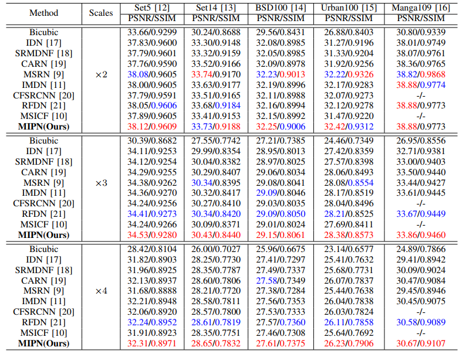

# MIPN

Single Image Super-Resolution via Multi-Scale Information Polymerization Network

Paper link: [SPL 2021](https://ieeexplore.ieee.org/document/9442897)

### Testing
Please download test result
Baidu drive link: [Download](https://pan.baidu.com/s/1VROIeLh0PVXpM5g3OxyY6g)
提取码：yeoc

The following PSNR/SSIMs are evaluated on Matlab R2017a and the code can be referred to [Evaluate_PSNR_SSIM.m](https://github.com/yulunzhang/RCAN/blob/master/RCAN_TestCode/Evaluate_PSNR_SSIM.m).

### PSNR & SSIM
<p align="center">
     <br />
    <em> Average PSNR/SSIM on datasets Set5, Set14, BSD100, Urban100, and Manga109. </em>
</p>

### Visual Comparisons
<p align="center">
     <br />
    <em> Visual comparisons of MIPN with other SR methods on Urban100 datasets. </em>
</p>

### Citation
If you find the code helpful in your resarch or work, please cite the following papers.
```
@article{lu2021single,
  title={Single image super-resolution via multi-scale information polymerization network},
  author={Lu, Tao and Wang, Yu and Wang, Jiaming and Liu, Wei and Zhang, Yanduo},
  journal={IEEE Signal Processing Letters},
  volume={28},
  pages={1305--1309},
  year={2021},
  publisher={IEEE}
}
```
---

<details>
<summary>statistics</summary>


</details>
